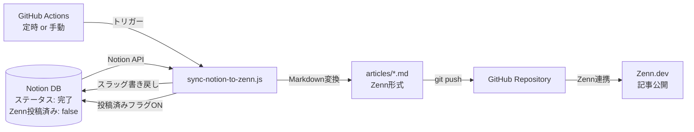

# 🔄 zenn-notion-sync

[](https://github.com/ryusei2790/zenn-notion-sync/actions/workflows/sync.yml)
[](https://opensource.org/licenses/MIT)
[](https://nodejs.org/)
[](https://developers.notion.com/)

> **Notionで書いた記事をZennへ自動同期するツール。GitHub Actionsで定時実行・手動実行に対応。**

## 📖 概要

Notionデータベースを「記事の執筆・管理ハブ」として使い、ステータスが「完了」になった記事をZenn形式のMarkdownファイルに自動変換してリポジトリへコミットします。
GitHubとZennを連携しておけば、Notionで書くだけで記事が公開されます。

### なぜ作ったのか（モチベーション）

- Notionで書いた記事を手動でコピペしてZennに貼り直す作業が面倒だった
- 記事の管理・ステータス管理はNotionで一元化したかった
- 将来的にはnote・WordPress・はてなブログなど**全ブログプラットフォームへの振り分けSEOツール**として拡張することを見据えている

## ✨ 主な機能

- **自動同期**: Notionの「完了」記事を検出し、Zenn用Markdownに自動変換
- **フロントマター生成**: タイトル・絵文字・タイプ・トピック・公開設定を自動付与
- **スラッグ自動生成**: Zennスラッグ未設定の場合、タイトルから自動生成してNotionへ書き戻し
- **定時実行**: GitHub Actionsで毎日6:00 / 12:00 / 18:00 (JST) に自動同期
- **手動実行**: `workflow_dispatch` で任意のタイミングでも同期可能

## 🛠 技術スタック

| カテゴリ | 技術 |
|:--|:--|
| ランタイム | Node.js 20.x |
| Notion連携 | `@notionhq/client` |
| Zenn連携 | `zenn-cli` |
| CI/CD | GitHub Actions |

## 🏗 アーキテクチャ



## 🗂 Notionデータベース構成

以下のプロパティをNotionデータベースに用意してください。

| プロパティ名 | 型 | 説明 |
|:--|:--|:--|
| 名前 | タイトル | 記事タイトル |
| ステータス | ステータス | `完了` になった記事が同期対象 |
| Zenn投稿済み | チェックボックス | 同期済みかどうかのフラグ（自動更新） |
| Zennスラッグ | テキスト | 省略時は自動生成（自動書き戻し） |
| Zenn絵文字 | テキスト | 記事の絵文字（省略時: 📝） |
| Zennタイプ | セレクト | `tech` or `idea` |
| Zennトピック | マルチセレクト | Zennのトピックタグ（最大5つ） |
| Zenn公開 | チェックボックス | `true` で公開記事 |

## 🚀 はじめ方

### 前提条件

- Node.js 20.x 以上
- Notionインテグレーション（APIトークン取得済み）
- ZennとGitHubリポジトリを連携済み

### セットアップ

```bash
# リポジトリをクローン
git clone https://github.com/ryusei2790/zenn-notion-sync.git
cd zenn-notion-sync

# 依存関係をインストール
npm install
```

#### Notion APIトークンの設定

1. [Notion Integrations](https://www.notion.so/my-integrations) でインテグレーションを作成
2. シークレットトークンをコピー
3. 対象のNotionデータベースにインテグレーションを接続

#### `sync-notion-to-zenn.js` のデータベースIDを設定

```js
// sync-notion-to-zenn.js の該当行を編集
const databaseId = 'YOUR_DATABASE_ID';
```

#### GitHub Secretsの設定

リポジトリの `Settings > Secrets and variables > Actions` に以下を追加：

| Secret名 | 値 |
|:--|:--|
| `NOTION_TOKEN` | NotionのAPIシークレット |

### ローカルで実行

```bash
NOTION_TOKEN=your_token npm run sync
```

### Zennプレビュー

```bash
npm run preview
# http://localhost:8000 でプレビュー可能
```

## 🔮 今後のロードマップ

現在はZennのみ対応ですが、**全ブログプラットフォームへの統合SEOツール**として拡張予定です。

- [ ] note への自動投稿
- [ ] WordPress への自動投稿
- [ ] はてなブログへの自動投稿
- [ ] SEOスコアに基づくプラットフォーム振り分け機能
- [ ] 複数プラットフォームへの同時投稿

## 📄 ライセンス

このプロジェクトは [MIT License](LICENSE) の下で公開されています。
